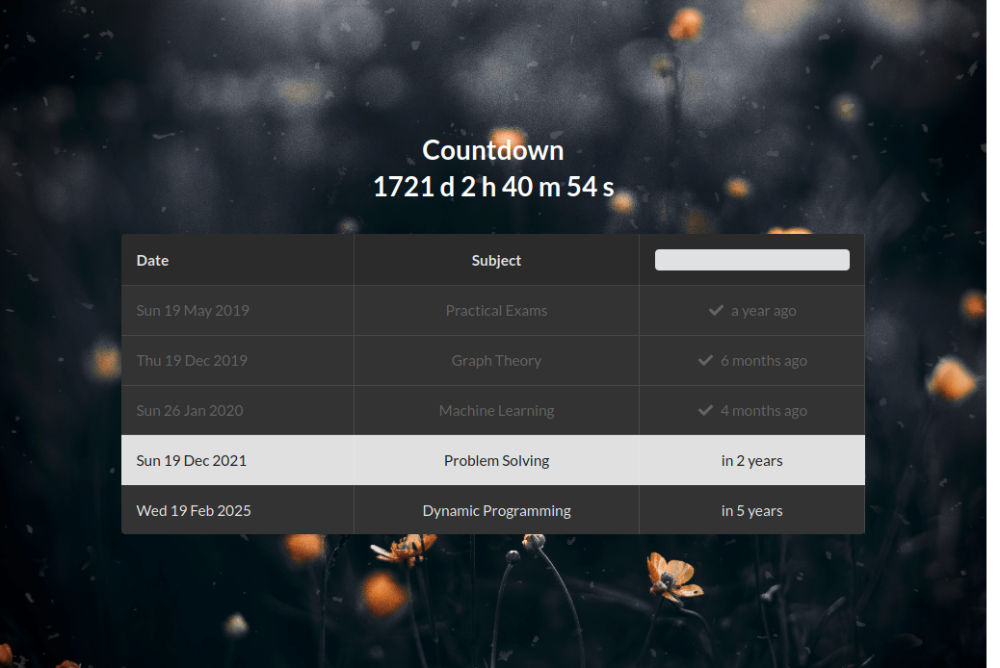

# Exams table

## Development

You can use **Docker** :whale: to spin up a webserver

```shell
docker run -d -p 80:80 -v `pwd`:/usr/share/nginx/html nginx:alpine
```

Or VSCode _LiveServer_, etc...

## Screenshot



## Deploy

You can use _Github_ pages. Just click `Use this template` button, then edit the `exams.json` file according to your exams table and you are done!

You can find a live demo <https://kerolloz.github.io/exams-table/>
